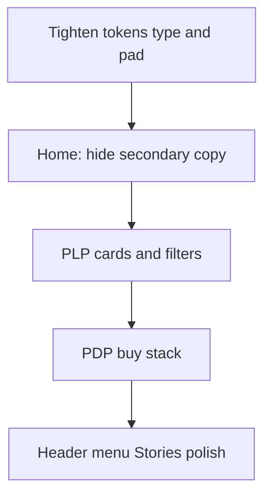

# Mobile-first density pass

## Problem
On phones, Rivlet still reads like a desktop editorial layout: oversized display clamps, every section showing eyebrow + headline + lede, and PLP/PDP cards stacking blurb + pieces + chips + full CTAs. Result: long scroll, clipped chrome, and “too many details.”

## Approach
**Progressive disclosure on ≤899px** — keep brand, product image, price, and one clear action; hide or shrink secondary blurbs, duplicate heads, and dense meta. Prefer CSS in existing mobile blocks over rewriting marketing copy. Desktop stays unchanged.

## 1. Global mobile type + spacing
File: [`src/styles/tokens.css`](src/styles/tokens.css) (`max-width: 899px`)

- Lower floors:
  - `--text-2xl` → `clamp(1.35rem, 4.5vw, 1.75rem)`
  - `--text-3xl` → `clamp(1.5rem, 5.5vw, 2rem)`
  - `--pad-section` → `clamp(2rem, 7vw, 3.25rem)`
- Align page-level clamps that ignore tokens (in [`src/styles/pages.css`](src/styles/pages.css) mobile block):
  - `.display`, `.final-cta__title`, `.pdp-buy h1`, `.split-shop__tile strong`, `.story-platform__title`, situation/platform titles
- Shrink mobile nav links in [`src/styles/components.css`](src/styles/components.css): `.mobile-nav__links a` ~`1.5rem`

## 2. Home — cut scroll and duplicate narrative
Files: [`src/pages/home.ts`](src/pages/home.ts), [`src/styles/pages.css`](src/styles/pages.css)

Under `max-width: 899px` (and `640px` where noted):

| Section | Keep | Hide / shrink |
|---|---|---|
| Hero | Brand, motto, CTA | `.hero__support`, hero eyebrow; slightly smaller brand mark |
| Friction / Promise | One head + film titles | Promise blurbs; shorter film `min-height` |
| Situations | Panel title only | Panel blurb + “View edit”; section lede |
| Split shop | Image + title | Subtitle lines; lower tile height + title clamp |
| Looks | Featured visual + 3 cards + one “Explore” CTA | Second `.section-head` under featured band; featured lede/price line; secondary look-card text links |
| Platforms | Cards + primary CTA | `.platforms-foot__line`, section lede listing platforms; shorter cards |
| Trust / Reviews | Titles + quotes | Trust body paragraphs ≤640px; slightly smaller review quote type |
| Final CTA | Title + form | Lede/hint ≤640px; lower `.final-cta__title` floor |
| Footer | Lockup + links | Motto/lede echo on mobile |

## 3. Collection + Looks PLP
Files: [`src/pages/shop.ts`](src/pages/shop.ts), [`src/pages/sets.ts`](src/pages/sets.ts), [`src/styles/components.css`](src/styles/components.css), [`src/styles/pages.css`](src/styles/pages.css)

- **Looks cards** (2-up): hide `.coord-card__blurb` and `.coord-card__pieces` on mobile; shrink `.coord-card__name`; keep image, price, colour dots, one CTA (or tap-through if CTA still feels heavy).
- **Collection cards**: hide `.product-card__meta--chips` ≤640px; single-line name clamp; slightly shorter Quick add.
- **Filters**: hide `.filter-group__label` on mobile; shorten `.plp-head .lede` to count-only via a `plp-head__meta` pattern or CSS-friendly shorter mobile string in TS.
- Keep existing mobile filter toggle; do not redesign filter IA in this pass.

## 4. Product + Look PDP
Files: [`src/styles/pages.css`](src/styles/pages.css), [`src/ui/pdpBuy.ts`](src/ui/pdpBuy.ts) only if CSS alone is insufficient

- Cap `.pdp-buy h1` on mobile (~`1.85–2.05rem`)
- Show max 2 benefit bullets on mobile (CSS `:nth-child` hide, or slice in `benefitBulletsHTML` when `matchMedia`)
- Collapse trust details: show titles only under `899px` (hide `.pdp-trust` detail lines)
- Remove tall `.pdp-get-look__media` `min-height`; use aspect-ratio only
- Hide gallery “Hover to zoom” hint on touch (`(hover: none)`)
- Keep sticky mobile ATC

## 5. Stories + chrome polish
Files: [`src/pages/stories.ts`](src/pages/stories.ts) structure unchanged; styles in [`src/styles/pages.css`](src/styles/pages.css), [`src/styles/components.css`](src/styles/components.css)

- Cap platform titles; hide outcome **or** shorten media (`max-height` ~40–50vh)
- Slightly reduce mobile search-pill height (keep search in header; no full redesign)
- Announce rail already has short mobile copy — leave as-is unless still clipping

## Out of scope (this pass)
- Desktop layout / brand voice rewrites
- Filter IA redesign (“More filters” sheet)
- Collapsing header search into icon-only (larger UX change)
- Size-guide column redesign (follow-up if still heavy after PDP trim)

## Validation
- Spot-check at ~375px width: Home, `/shop/`, `/sets/`, one Product PDP, one Look PDP, Stories
- Confirm desktop ≥900px unchanged for hero, mega menu, 3-up grids, full PDP buy panel
