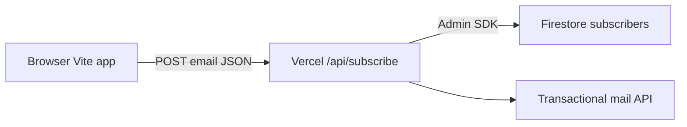

# Rivlet coming-soon: full app + email + responsive plan

## Goals

- **Preserve design**: Treat the current [index.html](c:\Users\HarichandruThirumuru\Documents\Vercel\Rivlet Coming soon\index.html) as the source of truth for typography, color tokens, spacing, and section structure. The migration is a **mechanical port** (same class names, same structure) plus **responsive fixes**, not a rebrand.
- **Data + mail**: On **Get early access** / CTA submit, **store** the email in **Google Firebase (Firestore)** with a **reliable server timestamp** and a human-readable local time (optional field for reporting), and:
  1. **Welcome** email to the user — **From** `earlyaccess@therivlet.com` (after domain verification with your mail provider).
  2. **Internal alert** to `earlyaccess@therivlet.com` — e.g. “`user@…` just subscribed at …” (or use a second inbox if you later split `notify@` vs `earlyaccess@`).
- **Responsive UI**: Make layout and tap targets work well on **phone**, **tablet**, and **large** screens, including the **navigation** and dense sections (tabs, comparison ledger, marquees, CTA, modal).

**Architecture (your choice: Vite on Vercel + API)**

- **Do not** send mail from the browser and **do not** keep the EmailJS placeholders in production. Move secrets to Vercel environment variables. Use a **Vercel Serverless / Edge function** (Node) that:
  - Validates email.
  - Writes the document with `email`, `source`, `subscribedAt: serverTimestamp()`, and optionally `timezone` or `userAgent` if you want later analytics.
  - Sends two emails in one place (simpler operations than split client Firestore + separate trigger while you are on Vercel only).

- **Firebase Admin SDK** in the API route: requires a **service account** JSON in Vercel (or split env vars as Firebase docs describe). The **client** no longer needs direct Firestore write access for subscribers; lock **Firestore security rules** so `subscribers` is not publicly writable (Admin bypasses rules).

- **Transactional email provider**: [Resend](https://resend.com) is a good default (simple API, Vercel-friendly) or **SendGrid** / **Mailgun** — you must add **SPF + DKIM** (and DMARC) DNS records for `therivlet.com` so **From: earlyaccess@therivlet.com** is trusted. Without DNS setup, inboxes will spam-block or reject mail.

- **Client Firebase**: Keep **client-side Firebase** only for **Analytics** (optional) using the same `firebaseConfig` you already have in [index.html](c:\Users\HarichandruThirumuru\Documents\Vercel\Rivlet Coming soon\index.html) lines 588–606, or drop Analytics if you want a minimal client bundle. **Firestore client SDK** can be removed for the signup path to avoid two write paths.

---

## Implementation outline

### 1. Scaffold: Vite + React + project layout

- Create a standard **Vite + React + TypeScript** app in this repo.
- **Extract** the giant `<style>` block into a single [src/index.css](c:\Users\HarichandruThirumuru\Documents\Vercel\Rivlet Coming soon\src\index.css) (or split by section only if you need maintainability, without changing selectors).
- **Split** the inline Babel `App` / sections into colocated files under e.g. `src/components/` (`Nav`, `Hero`, `Difference`, `Vision`, `Promises`, `Standards`, `CTA`, `Footer`, icons/data constants).
- Put image references under `public/assets/...` so `url("/assets/...")` keeps working. Add any missing real images from your previous export (the repo currently has only [index.html](c:\Users\HarichandruThirumuru\Documents\Vercel\Rivlet Coming soon\index.html)).

### 2. API: `POST /api/subscribe`

- Add `api/subscribe.ts` (or the Vite + Vercel convention you pick: `vercel.json` with `rewrites` if needed) that:
  - `400` on invalid email; `200` on success; `500` on provider errors.
  - Uses **Resend** (or chosen provider) to send:
    - **To subscriber**: subject/body for welcome (use their name from local part or “there”).
    - **To** `earlyaccess@therivlet.com`: “New subscription: {email} at {ISO or IST string}.”
  - Commits to Firestore `subscribers` with e.g. `{ email, source: "rivlet-coming-soon", subscribedAt, createdAtIso: optional for dashboard export }`.

- Store **no secrets** in the repo. Document required env keys in a short `README` section: `FIREBASE_SERVICE_ACCOUNT` (or equivalent), `RESEND_API_KEY`, `MAIL_FROM=earlyaccess@therivlet.com`, `MAIL_NOTIFY_TO=earlyaccess@therivlet.com`.

### 3. CTA + modal wiring

- Replace `window.__rivletSaveSubscriber` and `window.__rivletSendEmails` with a single `fetch("/api/subscribe", { method: "POST", body: JSON.stringify({ email }) })` in the CTA component (the logic today is in the `CTA` function around the submit handler in [index.html](c:\Users\HarichandruThirumuru\Documents\Vercel\Rivlet Coming soon\index.html) near lines 1051–1071).
- Keep the same success state, modal, and error message UX.

### 4. Firestore rules and indexes

- **Rules**: `subscribers` read/write denied for all clients; only server Admin SDK.
- If you add any client-readable collection later, keep it separate. No composite index is needed for a simple `add` unless you query with filters (then add only what Firebase console asks).

### 5. Responsive / UI corrections (no visual redesign)

Focus on **behavioral** fixes so the *same* design system scales. Priority areas visible in the current CSS:

- **Nav** (critical): [index.html](c:\Users\HarichandruThirumuru\Documents\Vercel\Rivlet Coming soon\index.html) hides `.nav-links` until `min-width: 880px`, and there is no mobile menu — on phones users see logo + CTA but **no section links**. Add a **hamburger** + **drawer/overlay** or a compact **top sheet** reusing the same link list and the “Get early access” CTA, with `aria-*` and focus trap for accessibility.
- **Touch targets**: Ensure buttons/links in tabs, comparison rows, and the capture form are at least ~44px where needed; adjust padding in media queries only.
- **Comparison (`.cmp`)** — already stacks on small screens (lines 337–344 in [index.html](c:\Users\HarichandruThirumuru\Documents\Vercel\Rivlet Coming soon\index.html)). Verify on **tablet** (e.g. 600–900px) that label columns do not look broken; add an intermediate rule if a column gets too wide.
- **Marquees (mills / fab track)**: Reduce horizontal padding, ensure no horizontal page overflow; consider `prefers-reduced-motion` already present — keep.
- **Hero + tabs**: The tab grid (lines 149–152) is good for narrow screens; re-check the **ed-show** two-column handoff at ~880px so the image block does not dominate awkwardly in portrait tablet.
- **CTA + modal**: `capture` row should stack (email full width, button full width) below ~400px if needed; modal [`.mdl-card`](c:\Users\HarichandruThirumuru\Documents\Vercel\Rivlet Coming soon\index.html) should use `max-height` + `overflow-y: auto` on small viewports to avoid cut-off.
- **Footer** grid: adjust `foot-grid` at one more breakpoint (single column for narrow phones) if the two-column layout still crams links.

Use a **clear breakpoint set** in CSS (e.g. 480 / 640 / 880 / 1200) aligned with your existing 760 / 880 usage—document it in a one-line comment at the top of the main stylesheet for future edits.

### 6. Vercel configuration

- **Build**: `npm run build` (Vite output to `dist`).
- **Vercel**: Root directory, framework preset Vite, environment variables for production and preview. Ensure **API** routes in `/api` are included (Vercel’s default for serverless in project root). If the API must live in `server/`, set `vercel.json` rewrites so `/api/*` still routes correctly.

### 7. What you will need outside code

- **Resend (or other)** account + **domain verification** for `therivlet.com` so `earlyaccess@` can be the From/Reply address.
- **Google Workspace** (or forwarding) so `earlyaccess@therivlet.com` actually **receives** the internal “new subscriber” message if you send it *to* that same address.
- **Firebase** project already in use: download **service account** for Admin SDK, restrict key usage to your deployment only.

---

## Out of scope (unless you want them later)

- A separate **admin dashboard** to list subscribers (could be Firebase Console for now, or a protected Next/Auth page in a follow-up).
- i18n, CMS, or blog (`#journal` is in-nav only today).

## Success criteria

- Visual parity on desktop for all sections; improved usability on 360px, 768px, and 1440px+ widths.
- One submit action stores **one** Firestore document with a **server timestamp** and sends **two** emails.
- No API keys in the client bundle; Firestore not publicly writable for `subscribers`.
