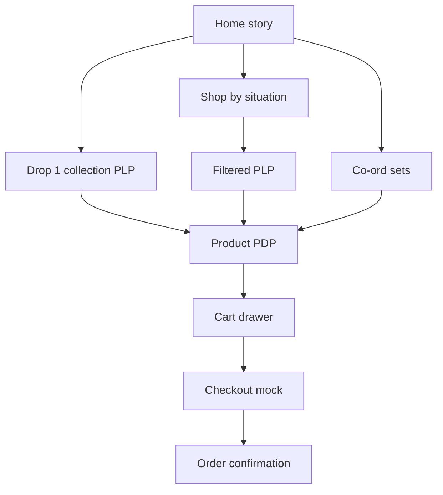

# Rivlet Drop 1 Luxury Ecommerce Prototype

## Locked decisions

- **Scope (1C):** All 6 Drop 1 products shoppable; working cart (localStorage); polished **mock** checkout + confirmation (no real payments).
- **Visual (2A):** Extend [therivlet.com](https://therivlet.com) — warm editorial continuity, not a dark athletic reboot.
- **Stack:** Vite + TypeScript + custom CSS design tokens. **No Bootstrap / Kendo.** Light utility layer only if it speeds layout; premium look comes from tokens + composition, not a component kit.
- **Audience for Drop 1:** Women-first (matches SKUs: bra, cup-inclusive tanks, co-ord). Lifestyle brand frame remains (“one wardrobe, four roles”), but catalog is Drop 1 women’s launch.

## Competitive synthesis (patterns to steal, not copy)


| Borrow from   | Pattern for Rivlet                                                            |
| ------------- | ----------------------------------------------------------------------------- |
| Alo           | Editorial whitespace, full-bleed imagery, quiet luxury pacing                 |
| Gymshark      | Clean shallow nav, creator/community energy without clutter, fast cart drawer |
| Fanka         | Tech → benefit storytelling on PDP (not promo wheels / popups)                |
| Knix          | Trust + education; confidence without medical heaviness                       |
| Breathewear   | Clean modern product presentation                                             |
| therivlet.com | Type, navy accent, four-role wardrobe language, motto                         |


**Avoid:** spin-to-win modals, promo banner stacks, deep mega-menus, card grids that look like a dashboard, bounce/pop motion, purple-gradient AI defaults.

## Experience principles → UI rules

1. **Zero waiting** — instant route transitions; optimistic add-to-cart (<150ms feel); poster-first images.
2. **Continuity** — one token language everywhere (spacing, type, buttons, imagery crop).
3. **One action per section** — home is a story, not banner soup.
4. **Fewer clicks** — situation entry + quick-add on PLP; co-ord “Add set” on PDP.
5. **Don’t make me think** — shop by **situation** first, categories second.
6. **Emotion map:** Home = curiosity → PDP = confidence → Cart = excitement → Checkout = trust → Confirm = delight.

## Design system (extend therivlet.com)

**Typography (match live site)**

- Display: Cormorant Garamond
- Body/UI: Inter
- Meta/SKU: DM Mono

**Color tokens**

- Canvas: warm off-white / soft cream (editorial, not flat white)
- Ink: near-black warm `rgb(14,11,7)` family
- Brand navy accent: `#0C1E34` (therivlet theme-color)
- Product: Midnight `#1A1208`, Cardamom `#7A5C3A`
- Surface/line: hairline warm greys; no heavy card chrome

**Motion:** fade + subtle scale (1→1.02); 200–300ms; no bounce. Hero may use muted loop video *or* high-quality still + ken-burns if video assets unavailable.

**Layout:** mobile-first (390 / 430), large whitespace, one composition per viewport, brand wordmark as hero-level signal on home.

## Information architecture




**Primary nav (shallow)**

- Shop (situations mega-lite: Gym / Yoga / Office / Travel / Summer)
- Drop 1
- Sets (Crop + Short co-ord)
- Stories (feeling → tech journal teasers)
- Icons: Search, Bag

**Not in V1 nav:** Partner QR flows, commissions, org dashboards (architecture later; optional stub `/?ref=` cookie only if time).

## Page map & section jobs

### 1. Home — curiosity (story, not catalog dump)

1. Full-bleed hero: brand **RIVLET** + motto *Move like water, feel like air* + one CTA (**Shop Drop 1**)
2. The friction (tropical humidity / visible sweat / all-day anxiety) — one short block
3. The promise (feeling headlines: No patch · No smell · No rub · No ride-up)
4. Shop by situation (5 tiles → filtered PLP)
5. Drop 1 edit (6 products, quiet grid — not cards-with-shadows)
6. The co-ord (AOV set moment)
7. Why it holds (South Asian block, hard-water, OEKO-TEX intent — light)
8. Reviews / social proof strip
9. Final CTA

### 2. PLP — Drop 1 / situation filters

- Minimal filters: Situation, Color (Midnight/Cardamom), Category (Leggings, Bra, Tops, Shorts, Tee)
- Product tile: image swap on hover, name, price (MRP from Drop 1), color dots, **Quick add** (size sheet)
- Sort: Featured / Price — keep sparse

### 3. PDP — confidence (template × 6 SKUs via data)

Scroll story:

1. Media (gallery / muted loop if available)
2. Sticky buy box: title, price, color, size, ATC, **Add co-ord** where applicable
3. How it feels (customer language from Drop 1 overview)
4. Problem → solution (SKU-specific from Problems Solved sheet)
5. Technology proof (fabric platform: AquaFlow™ / SecondSkin™ / NeutralCore™)
6. Fit & size guidance (XS–2XL; cup-inclusive note on bra/tanks)
7. Reviews
8. Complete the set / You may also need

**Drop 1 catalog (data-driven)**


| Code          | Product                    | MRP   | Platform     |
| ------------- | -------------------------- | ----- | ------------ |
| RVL-LEG-001   | High-Waist Leggings        | ₹1799 | AquaFlow™    |
| RVL-BRA-002   | Longline Sports Bra        | ₹1299 | SecondSkin™  |
| RVL-TNK-003-C | Built-in-Support Crop      | ₹1599 | SecondSkin™  |
| RVL-TNK-003-F | Built-in-Support Full Tank | ₹1599 | SecondSkin™  |
| RVL-SHT-004   | Seamless Matching Short    | ₹1499 | SecondSkin™  |
| RVL-TEE-005   | Training Tee               | ₹1299 | NeutralCore™ |


Colors: Midnight / Cardamom · Sizes: XS–2XL

### 4. Cart drawer — excitement

- Instant open on ATC; line items, qty, co-ord / complete-set hint, subtotal, **Checkout**
- Persist via `localStorage`
- Empty state with restrained brand voice (not gimmicky wit unless it matches Rivlet tone)

### 5. Checkout mock — trust

- Single-page mock: contact, address, shipping method, payment UI (disabled / “Prototype — no charge”)
- Order summary sidebar; no real gateway

### 6. Confirmation — delight

- Order number (generated), what’s next, continue shopping

## Project structure (in `rivlet-prototype-ecom`)

```
/
  index.html              # Home
  shop/index.html         # PLP
  product/index.html      # PDP (query ?id=RVL-LEG-001)
  checkout/index.html
  confirmation/index.html
  src/
    styles/
      tokens.css          # design system
      base.css
      components.css
      pages/*.css
    data/products.ts      # Drop 1 master
    cart.ts
    ui/*.ts               # nav, drawer, quick-add, filters
    main.ts
  public/assets/          # placeholders / product stills
```

Multi-page Vite setup keeps URLs shareable and feels like a real storefront; shared TS modules hydrate each page.

## Asset strategy

- Use **placeholder photography** styled to brand (solid Midnight/Cardamom product silhouettes + editorial lifestyle stock) until real shoot lands.
- Prefer WebP; lazy-load below fold; hero LCP prioritized.
- Optional: short muted hero loop later; ship stills first so performance stays elite.

## Out of scope (V1 prototype)

- Shopify / .NET / webhooks / commissions / partner QR dashboards
- Real payments, accounts, wishlist apps
- Men’s line, Drop 2 DryState claims
- Full 150-page design bible (encode principles as `DESIGN.md` + tokens instead)

## Build sequence

1. Scaffold Vite + tokens matching therivlet fonts/colors
2. Product data module from Drop 1
3. Shared shell (nav, footer, cart drawer)
4. Home story sections
5. PLP + filters + quick add
6. PDP template wired to all 6 SKUs
7. Checkout mock + confirmation
8. Motion polish + mobile pass + performance sanity

## Success criteria

- Feels like a continuation of therivlet.com, not a new brand
- All 6 SKUs browsable and addable; cart survives refresh
- Home reads as one story per section; PDP increases confidence while scrolling
- Mobile 390px first viewport: brand + one headline + one CTA + dominant visual
- No Bootstrap/Kendo chrome; no promo-modal clutter

